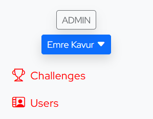
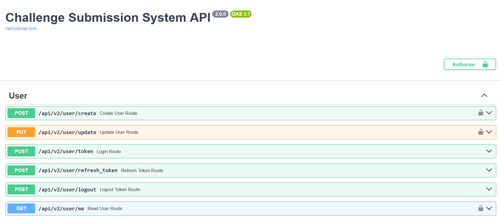
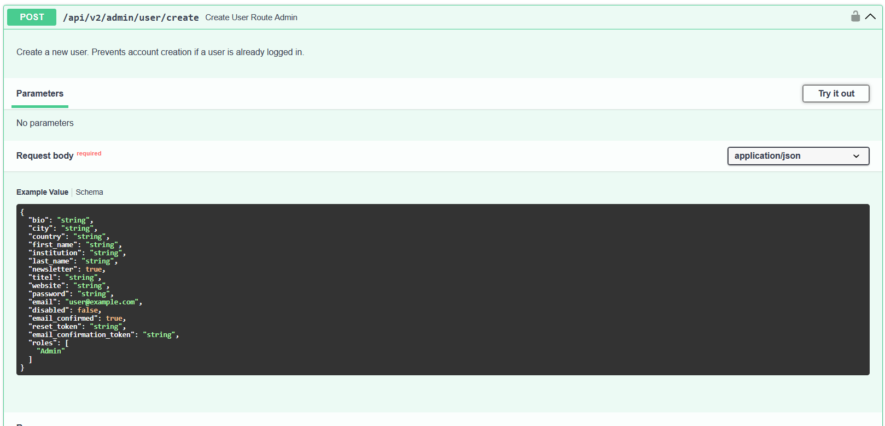
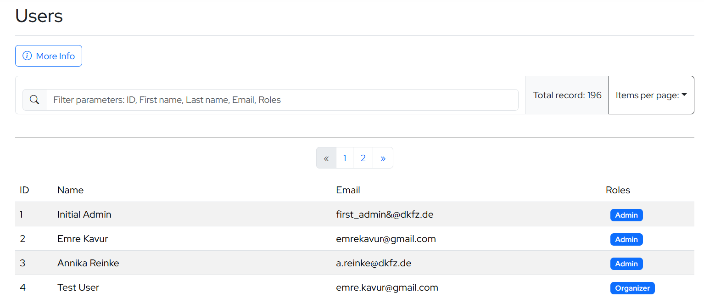
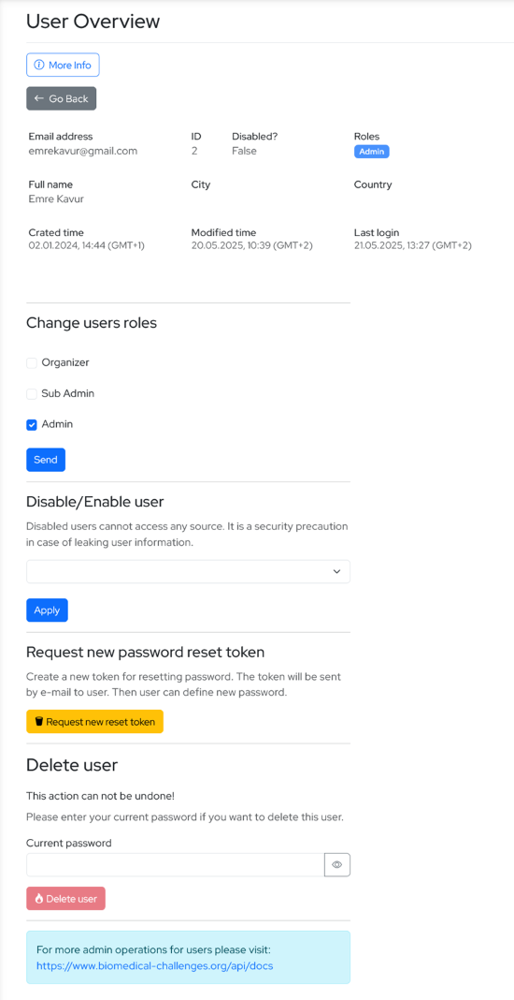
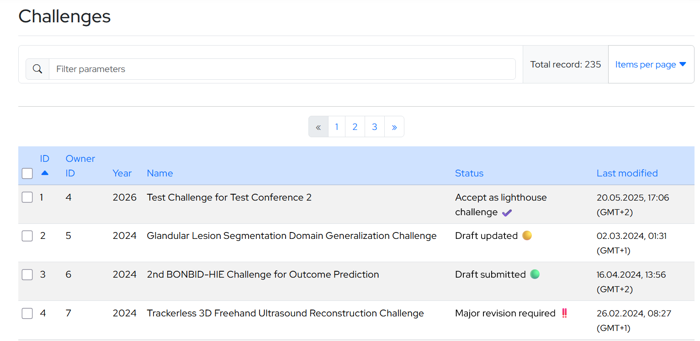
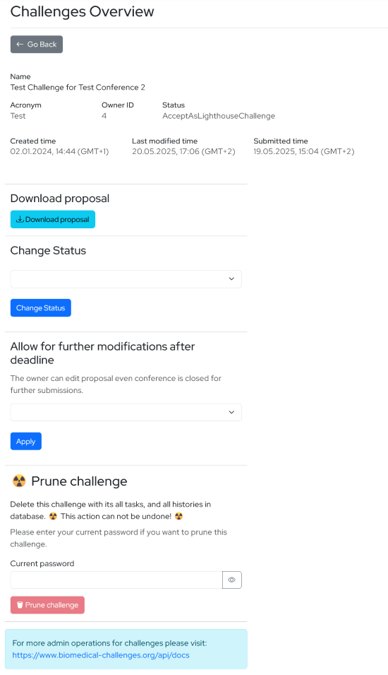
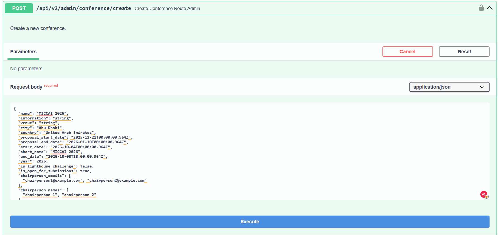
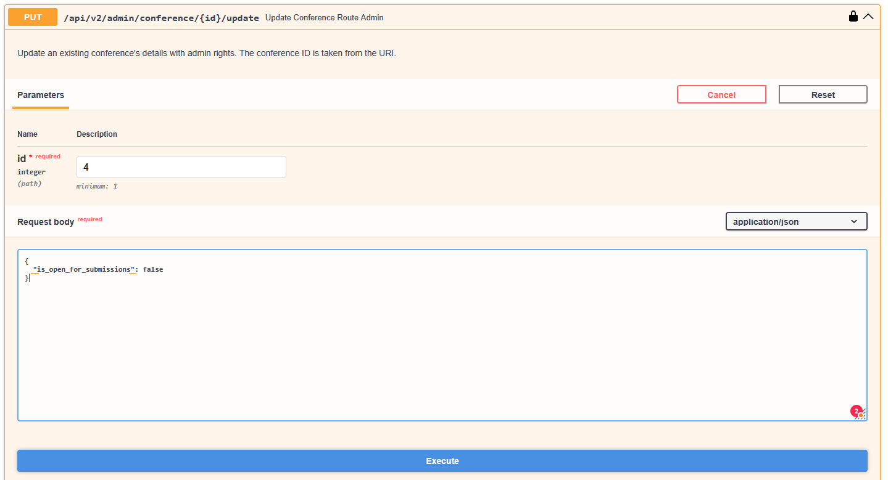
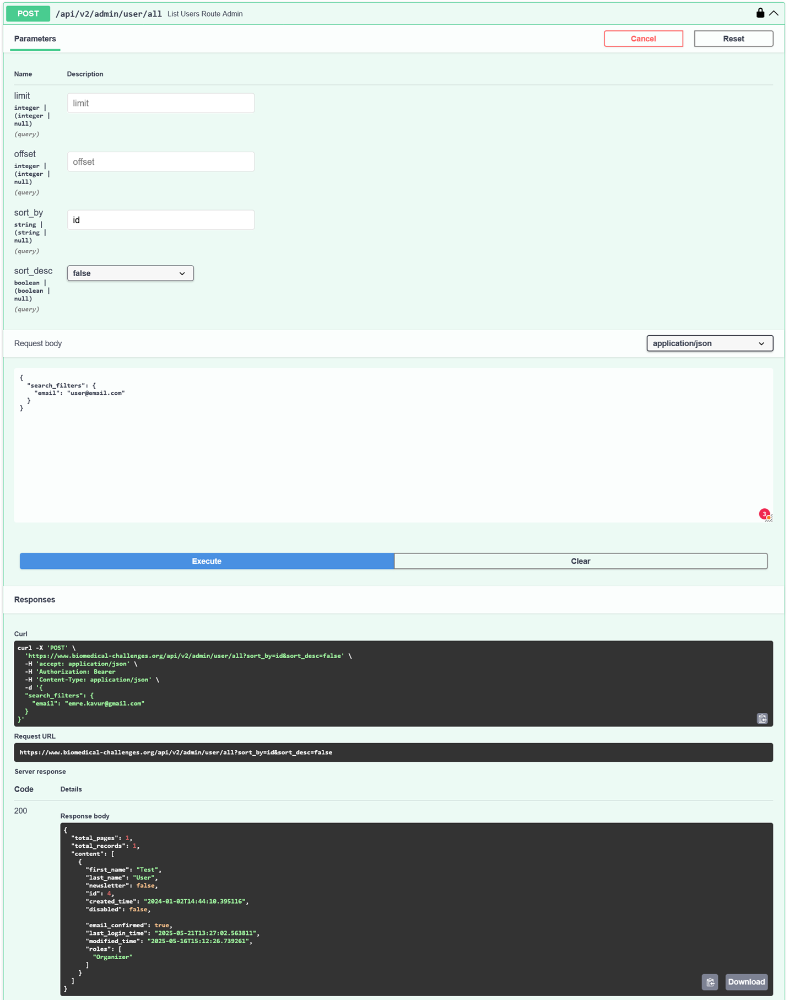

# BMC submission system User Manual <!-- omit in toc --> <!-- omit from numbering -->

*Created on 19.05.2025, by Emre Kavur*\
*Last updated on 22.05.2025, by Emre Kavur*

*(NOTE: This README covers usage of the system. If you are looking for documentations for development, deployment and maintenance, please README-md file on the root folder.)*

### Table of contents: <!-- omit in toc --> <!-- omit from numbering -->
<!-- TOC tocDepthFrom:1 tocDepthTo:3 chapterDepthFrom:1 chapterDepthTo:3 anchorMode:gitlab -->

- [1. Interfaces for admins](#1-interfaces-for-admins)
  - [1.1. Admin panel](#11-admin-panel)
  - [1.2. API documentations](#12-api-documentations)
    - [1.2.1. General usage of API documentations](#121-general-usage-of-api-documentations)
- [2. Routines](#2-routines)
  - [2.1. User registration](#21-user-registration)
  - [2.2. User login](#22-user-login)
  - [2.3. User logout](#23-user-logout)
  - [2.4. Challenge proposal generation](#24-challenge-proposal-generation)
  - [2.5. Challenge proposal status changes](#25-challenge-proposal-status-changes)
    - [2.5.1. Initial status path when a proposal is created, updated and submitted first time:](#251-initial-status-path-when-a-proposal-is-created-updated-and-submitted-first-time)
    - [2.5.2. Status paths when a proposal is revised for rebuttal, updated and submitted. The initial status is assigned by admins:](#252-status-paths-when-a-proposal-is-revised-for-rebuttal-updated-and-submitted-the-initial-status-is-assigned-by-admins)
    - [2.5.3. Status paths when further updates done for a proposal. The initial status is assigned by admins:](#253-status-paths-when-further-updates-done-for-a-proposal-the-initial-status-is-assigned-by-admins)
  - [2.6. Challenge proposal snapshots](#26-challenge-proposal-snapshots)
  - [2.7. Challenge proposal editing and generation after deadline](#27-challenge-proposal-editing-and-generation-after-deadline)
- [3. Management](#3-management)
  - [3.1. User management](#31-user-management)
    - [3.1.1. Admin panel](#311-admin-panel)
    - [3.1.2. API documentations](#312-api-documentations)
  - [3.2. Challenge management](#32-challenge-management)
    - [3.2.1. Admin panel](#321-admin-panel)
    - [3.2.2. API documentations](#322-api-documentations)
  - [3.3. Task management](#33-task-management)
  - [3.4. Conference management](#34-conference-management)
  - [3.5. Database management](#35-database-management)
  - [3.6. Redis management](#36-redis-management)
- [4. Useful examples](#4-useful-examples)
  - [4.1. Create a conference](#41-create-a-conference)
  - [4.2. Stop proposal editing and generation for a conference](#42-stop-proposal-editing-and-generation-for-a-conference)
  - [4.3. Get all info of an user from e-mail address](#43-get-all-info-of-an-user-from-e-mail-address)

<!-- /TOC -->


# 1. Interfaces for admins
There are two ways of managing system. 
## 1.1. Admin panel
The admin panel is embedded to the frontend of the system. It is only available for admins after log in. Currently [Challenges](https://www.biomedical-challenges.org/submission-system/challenges) and [Users](https://www.biomedical-challenges.org/submission-system/users) management are available here.



Currently the all management options are not available on frontend.

## 1.2. API documentations
All endpoints of the backend system are available from API documentations: https://www.biomedical-challenges.org/api/docs This documentation is created automatically by FastAPI using [Swagger](https://swagger.io/). Swagger is an OpenAPI initiative. It is a framework and set of tools for describing, designing, and documenting RESTful APIs. It has ability to use protected endpoints via log in option.



The admins must log in from "Authorize" button on top-right of the page with their credentials. Then the unlocked padlock symbol will changed to locked one. Now all endpoints that required admin rights are accessible.

To use an endpoint, click name of if. The accordion window will be open for more details. Click "Try it out" button a right. Then the endpoint will be ready to use.



### 1.2.1. General usage of API documentations

#### 1.2.1.1. **/api/v2/admin/.../all** endpoints:

These endpoints responses all entities of a model stored in database. It is possible to select limit, offset, sort_by, sort_desc options. It is also possible to apply "search_filters":{} and "output_filters":{} to narrow the list. 

Possible search options for "search_filters" are:

- **"field": "some text"** -> Search the field of entities with specific value. Example: `"challenge_name": "some text"` brings all challenges that has exactly "some text" value in "challenge_name" field.
- **"field__contains": "some text"** -> Search the field of entities with a containing value. Example: `"challenge_name__contains": "some text"` brings all challenges that contains "some text" in "challenge_name" field.
- **"field__like": "some text"** -> Search the field of entities with similar value. Example: `"challenge_name__like": "some text"` brings all challenges that is like "some text" in "challenge_name" field.
- **"field__ilike": "some text"** -> Similar operation with field__like, but case case-insensitive.
- **"field__startswith": "some text"** -> Search the field of entities with specific value. Example: `"challenge_name__startswith": "some text"` brings all challenges that starts with "some text" in "challenge_name" field.
- **"field__endswith": "some text"** -> Search the field of entities with specific value. Example: `"challenge_name__endswith": "some text"` brings all challenges that ends with "some text" in "challenge_name" field.
- **"field__lt": "some value"** -> Search the field of entities. Example: `"created_time__lt": "2022-01-01T00:00:00Z"` brings all challenges that created later than "2022-01-01T00:00:00Z". Valid for other numeric and data fields like "modified_time". Also available for "lte", "gt", "gte" comparisons.
- **"field__between": ["some value", "some value"]** -> Search the datetime field of entities. Example: `"created_time__between": [
      "2021-01-01T00:00:00Z",
      "2021-12-31T23:59:59Z"
    ],` brings all challenges that created between "2021-01-01T00:00:00Z" and "2021-12-31T23:59:59Z". Valid for other data fields like "modified_time"

Filtering the result with only specific fields is also possible with "output_filters" options.

**Example:**
```json
{
  "search_filters": {
    "challenge_name__contains": "cancer",
    "challenge_year__between": [
      "2024",
      "2025"
    ]
  },
  "output_filters": [
    "id",
    "challenge_name"
  ]
}
```
This request body to https://www.biomedical-challenges.org/api/v2/admin/challenge/all endpoint finds the challenges whose name contains "cancer" and organized between 2024 and 2025. It only responses "id" and "challenge_name" fields of the found entities.

#### 1.2.1.2. **/api/v2/admin/.../{id}** endpoints:
These endpoints returns the model with `id` from database. `id` must be provided in the request

#### 1.2.1.3. **/api/v2/admin/.../create** endpoints:
These endpoints used for creating a new entity to relevant database table. The fields are controlled by relevant schemas. They can be found at the end of the Swagger documentations like ModelInputAdminDTO.

#### 1.2.1.4. **/api/v2/admin/.../update/{id}** endpoints:
These endpoints used for updating the model with `id` in database. `id` must be provided in the request. The fields are controlled by relevant schemas. They can be found at the end of the Swagger documentations like ModelUpdateAdminDTO.

#### 1.2.1.5. **/api/v2/admin/.../bulk-update** endpoints:
Bulk version of update operation. The updated fields and model id's must be provided as list of dictionaries. The fields are controlled by relevant schemas as same as single update endpoints.

#### 1.2.1.6. **/api/v2/admin/.../delete/{id}** endpoints:
These endpoints used for deleting the model with `id` in database. `id` must be provided in the request. Many delete operations also needs admin password input as additional security layer.

#### 1.2.1.7. **/api/v2/admin/.../bulk-delete** endpoints:
Bulk version of delete operation. The model id's must be provided as list of integers. It needs admin password input as additional security layer.

# 2. Routines

## 2.1. User registration
1. Users creates new account on the system from: https://www.biomedical-challenges.org/submission-system/auth/registration
2. After that, a confirmation code is sent to registered e-mail address. Users are not allowed to perform any actions before confirmation in the system.
3. Users click the link in the e-mail or visit confirmation page: https://www.biomedical-challenges.org/submission-system/auth/confirmation
4. If the code is correct, e-mail is confirmed and user is activated.

## 2.2. User login
1. User visits login page: https://www.biomedical-challenges.org/submission-system/auth/login
2. If login successful, new access_token, refresh_token and other info is saved to Local Storage of user's browser. For each request to protected endpoints, these information was also sent with request headers with 'Authorization' name.

## 2.3. User logout
1. User clicks sign out button.
2. The system send token data to /user/logout endpoint of API. These token info is stored to Redis cache database. Also token info is deleted from user's Local Storage
3. If a refresh token request with these disabled tokens comes to system, that means tokens were stolen. The system immediately disables user's account. Only admins can re-enable user from admin panel (see User management)

## 2.4. Challenge proposal generation
1. User visits Challenge Proposals page: https://www.biomedical-challenges.org/submission-system/proposals
2. User creates a new proposal with the top-right button. User select the conference from the list, then can start editing. Only conferences that are open for submissions will be available in the list.
3. User fills the forms, creates task(s) to challenge. The system autosaves the forms in 30s interval.
4. If 90% of the forms are filed, user will be able to generate proposal.
5. When the proposal is generated, it will be read to download. Also notification e-mails will be sent to user, conference chairs and admins.

## 2.5. Challenge proposal status changes
There are three main stages for a Challenge proposal lifespan

1. Creating proposal, generating document, then uploading to CMT for first review
2. Revising proposal according to comments, generating document, then uploading to CMT for second review
3. If any minor revision is required, handling them, generating document, notifying challenge chairs

During this cycle the status of the proposal will be changed. Some of status changes will be done by submission system, some of them can only be assigned by challenge chairs o admins. The summary of the statuses are explained below:

### 2.5.1. Initial status path when a proposal is created, updated and submitted first time:

| System-assigned initial status | When modified | When PDF generated | Events after submission                 |
|--------------------------|---------------|--------------------|-----------------------------------------|
| Draft                    | DraftUpdated  | DraftSubmitted     | E-mail sent to Admins, Chairs and User. |


### 2.5.2. Status paths when a proposal is revised for rebuttal, updated and submitted. The initial status is assigned by admins:

| Admin-assigned initial status          | When modified               | When PDF generated            | Events after submission                 |
|-----------------------------------|-----------------------------|-------------------------------|-----------------------------------------|
| MinorRevisionRequired             | RevisionUpdated             | RevisionSubmitted             | E-mail sent to Admins, Chairs and User. |
| MajorRevisionRequired             | RevisionUpdated             | RevisionSubmitted             | E-mail sent to Admins, Chairs and User. |
| PrelimAcceptAsStandardChallenge   | RevisionUpdatedPrelimAccept | RevisionSubmittedPrelimAccept | E-mail sent to Admins, Chairs and User. |
| PrelimAcceptAsLighthouseChallenge | RevisionUpdatedPrelimAccept | RevisionSubmittedPrelimAccept | E-mail sent to Admins, Chairs and User. |

Note: The generated PDF files in revision stage will be marked blue for the differences from initial version.

### 2.5.3. Status paths when further updates done for a proposal. The initial status is assigned by admins:

| Admin-assigned initial status    | When modified               | When PDF generated          | Events after submission                 |
|-----------------------------|-----------------------------|-----------------------------|-----------------------------------------|
| AcceptedModifiedDraft       | AcceptedModifiedUpdated     | AcceptedModifiedSubmitted   | E-mail sent to Admins, Chairs and User. |
| AcceptAsLighthouseChallenge | AcceptAsLighthouseChallenge | AcceptAsLighthouseChallenge | E-mail sent to Admins, Chairs and User. |
| AcceptAsStandardChallenge   | AcceptAsStandardChallenge   | AcceptAsStandardChallenge   | E-mail sent to Admins, Chairs and User. |
| Accept                      | Accept                      | Accept                      | E-mail sent to Admins, Chairs and User. |
| Reject                      | -NOT POSSIBLE-              | -NOT POSSIBLE-              | -                                       |
| Locked                      | -NOT POSSIBLE-              | -NOT POSSIBLE-              | -                                       |
| CleanProposal               | CleanProposal               | CleanProposal               | E-mail sent to User.                    |

Note: The generated PDF files in revision stage (except CleanProposal) will be marked red for the differences from revised version. If "CleanProposal" is selected, the generated PDF file won't have any markings. Any previous markings will be removed.

## 2.6. Challenge proposal snapshots
The systems takes snapshots of challenge proposals and their connected tasks during certain statuses. These are stored in 'challenge_histories' and 'task_histories' tables of the database. 

1. For the first review of the proposal, a snapshot is taken when the status is set to **DraftSubmitted**
2. For the review stage, another snapshot is taken when  the status is set to **RevisionSubmitted** and **RevisionSubmittedPrelimAccept**
2. For the final revision stage, another snapshot is taken when  the status is set to **AcceptedModifiedSubmitted**, **AcceptAsLighthouseChallenge** and **AcceptAsStandardChallenge**

These snapshots are used for markings of the modifications that described in previous section. See *Challenge management* and T*ask management* sections for managing history entities. 

## 2.7. Challenge proposal editing and generation after deadline
1. If the conference is closed for submissions (see *Conference management*), it is not possible to modify proposal or generate proposal file
2. Admins can give access to individual proposals fo further editing. (see *Challenge and Task management*)
3. Then user can continue editing.


# 3. Management
## 3.1. User management
User management can be done from Admin panel and API documentations

### 3.1.1. Admin panel
The admin panel is located on: https://www.biomedical-challenges.org/submission-system/users



It is possible to list, order, search all users stored in database. 

Individual user settings can be changed by clicking entities. This is a typical user management page:


- Here the user roles can be changed. 
- The user can be disabled/enabled. Disabled users cannot access protected routes. The API returns them, they don't have permission to proceed.
- The user can also be deleted. Since it is an irreversible action, providing admin password is necessary to proceed.

### 3.1.2. API documentations
The related user operations are located on Admin (User routes): https://www.biomedical-challenges.org/api/docs#/Admin%20(User%20routes)

All endpoints described in [General usage of API documentations](#121-general-usage-of-api-documentations) sections are valid for User management
`UserCreateAdminDTO`, `UserUpdateAdminDTO` models are responsible for field controls of relevant operations.

## 3.2. Challenge management
Challenge management can be done from Admin panel and API documentations

### 3.2.1. Admin panel
The admin panel is located on: https://www.biomedical-challenges.org/submission-system/challenges



It is possible to list, order, search all challenges stored in database. 

Individual challenge settings can be changed by clicking entities. This is a typical challenge management page:


- Here the challenge proposal can be downloaded if there is any generated one.
- The challenge proposal status can be changed (important for revision, acceptance and reject situations)
- The challenge proposal can be set to allow for further modifications after deadline
- The challenge can also be pruned. Pruning is not only deleting just proposal, but also deleting all tasks of the challenge, all history records. Since it is an irreversible action, providing admin password is necessary to proceed.

### 3.2.2. API documentations

The challenge related user operations are located on Admin (Challenge routes): https://www.biomedical-challenges.org/api/docs#/Admin%20(Challenge%20routes)

All endpoints described in [General usage of API documentations](#121-general-usage-of-api-documentations) sections are valid for Challenge management
`ChallengeInputAdminDTO`, `ChallengeUpdateAdminDTO` models are responsible for field controls of relevant operations.

There are more useful endpoints for challenge management:

- Challenge status can also be change together from **/api/v2/admin/challenge/bulk-status** The IDs of the proposals and the desired status must be given in request body. Please refer `Body_bulk_update_challenge_status_route_admin_api_v2_admin_challenge_bulk_status_put` schema
- Challenge proposal can be downloaded together from **/api/v2/admin/challenge/bulk-download** The IDs of the proposals must be given in request body.
- Challenge proposal can be pruned together from **/api/v2/admin/challenge/bulk-prune** The IDs of the proposals must be given in request body. Also admin password must be given as a query parameter for extra protection.
- A snapshot of a challenge and its task can be taken manually from **/api/v2/admin/challenge/{id}/take_snapshot**. The ID of the challenge must be provided as path parameter. They will be saved in histories table of the database.
- Histories (snapshots) of a challenge model can be accessed from **/api/v2/admin/challenge/{id}/histories** The ID of the challenge must be provided as path parameter.
- Histories  of a challenge model can be deleted from **/api/v2/admin/challenge/{id}/histories** The ID of the challenge history (not challenge model itself) must be provided as path parameter. Also admin password must be given as a query parameter for extra protection.


## 3.3. Task management
The task related user operations are located on Admin (Task routes): https://www.biomedical-challenges.org/api/docs#/Admin%20(Task%20routes)

All endpoints described in [General usage of API documentations](#121-general-usage-of-api-documentations) sections are valid for Task management
`TaskInputAdminDTO`, `TaskUpdateAdminDTO` models are responsible for field controls of relevant operations.

Besides there are more endpoints:
- Histories (snapshots) of a task model can be accessed from **/api/v2/admin/task/{id}/histories** The ID of the task must be provided as path parameter.
- Histories  of a task model can be deleted from **/api/v2/admin/task/{id}/histories** The ID of the task history (not task model itself) must be provided as path parameter. Also admin password must be given as a query parameter for extra protection.

## 3.4. Conference management
The conference related user operations are located on Admin (Conference routes): https://www.biomedical-challenges.org/api/docs#/Admin%20(Conference%20routes)

All endpoints described in [General usage of API documentations](#121-general-usage-of-api-documentations) sections are valid for Task management
`ConferenceCreateAdminDTO`, `ConferenceUpdateAdminDTO` models are responsible for field controls of relevant operations.

See [4.1. Create a conference](#41-create-a-conference) section for more.

## 3.5. Database management
The database related user operations are located on Admin (Database): https://www.biomedical-challenges.org/api/docs#/Admin%20(Database)

- A backup of the database can be created and downloaded from **/api/v2/admin/database/database_backup_and_download** It is possible to give a file name. If not, the system will generate.
- Backup files of the database can be deleted from **/api/v2/admin/database/delete_database_backups** The default and recommended behavior is deleting all backup files except most recent one. If delete_all_backups option is selected True, all backup files will be deleted. Please be sure to download at least one backup before this operation. Also admin password must be given as a query parameter for extra protection.


## 3.6. Redis management
The Redis related user operations are located on Admin (Redis): https://www.biomedical-challenges.org/api/docs#/Admin%20(Redis)

- Health of Redis service can be controlled from **/api/v2/admin/redis/health**
- The value of a key stored Redis cache can be accessed from **/api/v2/admin/redis/** (GET) 'key' parameter must be provided as query parameter.
- All values of all keys stored Redis cache can be accessed from **/api/v2/admin/redis/all_keys** (GET)
- A value with a key can be stored Redis cache from **/api/v2/admin/redis/** (POST) 'key' and 'value' must be provided as request body.
- The value of a key stored Redis cache can be deleted from **/api/v2/admin/redis/** (DELETE) 'key' parameter must be provided as query parameter.
- All values of all keys stored Redis cache can be deleted from **/api/v2/admin/redis/delete_all_keys** Admin password must be given as a query parameter for extra protection.

# 4. Useful examples

All examples given here needs authorization to Swagger documents. Visit https://www.biomedical-challenges.org/api/docs, click "Authorize" button. Login with your admin credentials. Close the popup window. Now "Authorize" will shown with locked padlock symbol. Now you are ready to apply the following examples.

## 4.1. Create a conference
To create a conference entity for MICCAI 2026, follow these steps:

1. Go to https://www.biomedical-challenges.org/api/docs#/Admin%20(Conference%20routes)/create_conference_route_admin_api_v2_admin_conference_create_post Then click "Try it out" button.
2. Put the data below to the Request body, click execute button:
```json
{
  "name": "MICCAI 2026",
  "information": "string",
  "venue": "string",
  "city": "Abu Dhabi",
  "country": "United Arab Emirates",
  "proposal_start_date": "2025-11-21T00:00:00.964Z",
  "proposal_end_date": "2026-01-10T00:00:00.964Z",
  "start_date": "2026-10-04T00:00:00.964Z",
  "short_name": "MICCAI 2026",
  "end_date": "2026-10-08T18:00:00.964Z",
  "year": 2026,
  "is_lighthouse_challenge": false,
  "is_open_for_submissions": true,
  "chairperson_emails": [
    "chairperson1@example.com", "chairperson2@example.com"
  ],
  "chairperson_names": [
    "chairperson 1", "chairperson 2"
  ]
}
```

The created conference model will be included in API response.



## 4.2. Stop proposal editing and generation for a conference
Let's stop editing and proposal file generation for all challenge proposals connected to a specific conference.

1. If you don't know ID of the conference visit https://www.biomedical-challenges.org/api/docs#/Admin%20(Conference%20routes)/list_conferences_route_admin_api_v2_admin_conference_all_post Then click "Try it out" button.
2. Send this following Request body:
```json
{
  "search_filters": {
    "is_open_for_submissions": true
  }
}
```


3. Click execute. You will see the list of conferences that is open for submissions. Note the ID of the conference that desired to be closed.
4. Visit https://www.biomedical-challenges.org/api/docs#/Admin%20(Conference%20routes)/update_conference_route_admin_api_v2_admin_conference__id__update_put
5. Put ID of the conference as path parameter, and send the following data with request body, click execute button:

```json
{
  "is_open_for_submissions": false
}
```
6. The all connected challenges won't accept any modification or proposal generation now. If you want to give permission to specific challenge you can use admin panel for challenges (see *Challenge management*).



The updated conference model will be included in API response.

## 4.3. Get all info of an user from e-mail address

1. Go to https://www.biomedical-challenges.org/api/docs#/Admin%20(User%20routes)/list_users_route_admin_api_v2_admin_user_all_post Then click "Try it out" button.
2. Put the data below to the Request body, click execute button:
```json
{
  "search_filters": {
    "email": "user@email.com"
  }
}
```
3. Since we didn't filter result with output_filters, we will see all fields of the user model as in database.

